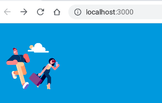

# Astro Zdog



Astro component for static rendering of [Zdog](https://zzz.dog/) scenes. The 3D scenes are rendered to svg which requires no JS.

[Demo](./src/components/Demo.astro)

## browser-env

zdog assumes its executing in a browser and calls into document. To make the astro static renderer happy with this you need to add browser-env to your index.astro page.

```typescript
import browserEnv from "browser-env";
browserEnv();
```

And due to issues with snowpack you need to add browser-env to your external module list. See [snowpack.config.js](./snowpack.config.js)
